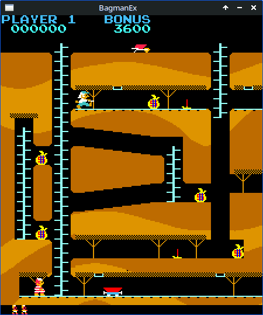

# BagmanEx Remake

<p align="center">
  
</p>

Original arcade game by Valadon Automation.
ROM strings show that it has been coded by Jacques Brisse (still head of Valadon).

Game has been resourced (Z80) and guard behaviour/speed has been reproduced
as faithfully as possible.

Based on a previous project by french programmer [Jean-François Fabre](https://github.com/jotd666).
Now with Linux support!

## Options:

+ -a: panoramic 3-screen windowed mode
+ -s: no sound
+ -g: direct game
+ -j: joystick
+ -i: invincible mode (cheat)
+ -f: full screen (lower part truncated since no HW rescaling)

## Keys:

- joystick or cursor keys: directions
- fire or ctrl: action
- P: pause
- ESC: quit current game
- F10: quit program

## What's better than the MAME version:

- game is slightly less unfair when you change screens with guards tailgating you (in the original game
  you find guard ahead of you in the next screen and you die). Same thing with the wagons
- guards have some extra animation when killed (same as the player actually)
- sometimes AI seems better than the original, in particular when guard are stuck (which is rare)
- panoramic mode
- fadein/fadeout effects
- C++/SDL source code included means fully portable
- settings/DSW that you can save
- eats a lot less CPU than the MAME version
- MAME version needs to hardware scale the screen in full screen mode. This version changes screen layout:
  no need for rescaling => no blurry pixels
- the original game had a tendency (not all the time) to leave the barrow in the last screen when you completed
  the level, which is unfair and makes next level very difficult because you have to bring back the barrow or go
  to last screen right after appearing in the first screen.
- ground-disappearing bug found when trying to drop a bag off a ledge in screen 3 in the elevator shaft.
- extra easy difficulty level
- fully credits Jacques Brisse for his work

## Building on Linux

### Dependencies

Debian/Ubuntu:

```bash
sudo apt install build-essential meson ninja-build libsdl1.2-dev libsdl-mixer1.2-dev
```

### Configure

From the project root:

```bash
meson setup builddir
```

### Build

```bash
meson compile -C builddir
```

### Run

The game currently expects to be run from the project root:

```bash
./builddir/src/bagman
```

### Reconfigure

If you modify the Meson build files:

```bash
meson setup builddir --reconfigure
```

or delete the build directory and configure again:

```bash
rm -rf builddir
meson setup builddir
```
